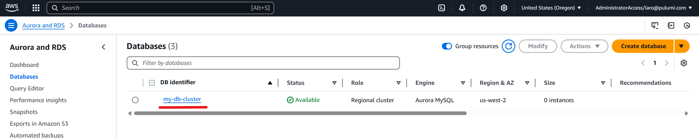

# ESC Secret Rotation Connector Lambda for Database Credential Rotation

This document explains the AWS resources deployed by the `esc-connector-lambda-typescript` Pulumi template and provides step-by-step instructions for manual deployment if needed.

## Overview

The Rotation Connector Lambda acts as a secure proxy for database credential rotation within your VPC. 
It enables Pulumi ESC to safely rotate database credentials without exposing your database to external networks. 

## Resources Deployed

This Pulumi program deploys the following AWS resources:

1. **Lambda Function** - Serves as a proxy for credential rotation operations
2. **Code Signing Configuration** - Verifies the integrity and authenticity of the deployed code
3. **Security Group Rules** - Enables network access between the Lambda and database
4. **Assumed Role** - Allows Pulumi ESC to invoke the Lambda

Additionally an [OIDC identity provider](https://www.pulumi.com/docs/esc/environments/configuring-oidc/aws/) will be provisioned if one does not already exist.

## Configuration Parameters

| Parameter                                         |Required | Description                                                         |
|---------------------------------------------------|---------|---------------------------------------------------------------------|
| `aws:region`                                      | Y       | AWS region for deployment                                           |
| `esc-connector-lambda-typescript:rdsDbIdentifier`              | Y       | The DB Identifier of the RDS cluster for which rotating secrets are being configured. |
| `esc-connector-lambda-typescript:rotatedSecretsEnvironmentName`| Y       | Name of the environment that will rotate the DB credentials. Format of the name needs to be `myProject/myEnvironment`. |
| `esc-connector-lambda-typescript:managingCredsEnvironmentName` | N       | Name of the environment that will contain the privileged managing user credentials used to rotate the user DB credentials. Otherwise the name will be derived from the rotated secrets environment name. |
| `esc-connector-lambda-typescript:backendUrl`                   | N       | The Pulumi Cloud URL. Change this URL ONLY if you are self-hosting Pulumi Cloud. |

### Finding RDS DB Identifier

To find your RDS DB Identifier to put into the configuration, simply navigate to RDS in the console and copy the identifier.

## Manual Deployment Steps

If you prefer to deploy these resources manually rather than using Pulumi, follow these steps:

### 1. Configure Security Groups

Enable network access so the Lambda will be able to connect to your database.

1. Create a security group for the Lambda and allow it to connect to your database:
   - VPC: Your target VPC
   - Description: "Security group for Pulumi ESC rotation lambda"
   - Outgoing rule:
     - Type: Custom TCP
     - Port: Your database port (e.g., 3306)
     - Destination: Your database security group

2. Update your database's security group to allow incoming connections from the Lambda:
   - Incoming rule:
     - Type: Custom TCP
     - Port: Your database port (e.g., 3306)
     - Source: The Lambda security group

### 2. Install the Lambda Function

Deploy the code that will handle credential rotation requests within your VPC.

1. Navigate to the Lambda console and create a new function
2. Basic settings:
    - Runtime: Amazon Linux 2023
    - Execution role: Create a new role with basic Lambda execution permissions

3. Advanced settings:
    - Enable VPC: Yes
    - VPC: Your target VPC
    - Subnets: Select private subnets
    - Security groups: Select the Lambda security group created earlier

4. Code signing (create inline during Lambda setup):
    - Enable code signing
    - Signing profile: Use ESC's profile ARN: `arn:aws:signer:us-west-2:388588623842:/signing-profiles/pulumi_esc_production_20250325212043887700000001/jva5X9nqMa`
    - Signing policy: Enforce

5. Code source:
    - Amazon S3 location
    - Use the S3 Bucket for your region: `public-esc-connector-lambda-production-{region}`: 
      - For example: `https://public-esc-connector-lambda-production-us-west-2.s3.us-west-2.amazonaws.com/aws-lambda/latest.zip`
    - S3 Key: `aws-lambda/latest.zip`
    - Handler: `bootstrap`

Take note of the lambda's arn.

### 3. Create Assumed Role for ESC

Allow Pulumi ESC to securely invoke the Lambda

1. In IAM, create a new role:
    - Name: `PulumiESCConnectorLambdaInvocationRole`
    - Trust relationship: Allow the federated access via the OIDC identity provider to assume this role.
    - You may add additional subject attribute conditions to restrict the role to being used by certain esc environments. ([See documentation](https://www.pulumi.com/docs/esc/environments/configuring-oidc/aws/#subject-claim-example)) 

   ```json
   {
     "Version": "2012-10-17",
     "Statement": [
       {
         "Action": "sts:AssumeRole",
         "Effect": "Allow",
         "Principal": {
           "Federated": "arn:aws:iam::{AWS_ACCOUNT_ID}:oidc-provider/api.pulumi.com/oidc"
         },
         "Condition": {
           "StringEquals": {
              "api.pulumi.com/oidc:aud": "aws:{PULUMI_ORGANIZATION_NAME}",
            }
         }
       }
     ]
   }

2. Add an inline policy granting Lambda invocation and update permissions to the ARN of the Lambda you deployed
   ```json
   {
     "Version": "2012-10-17",
     "Statement": [
       {
         "Sid": "AllowPulumiToInvokeLambda",
         "Effect": "Allow",
         "Action": [
           "lambda:GetFunction",
           "lambda:InvokeFunction"
         ],
         "Resource": "arn:aws:lambda:{region}:{account-id}:function:{lambda-name}"
       },
       {
         "Sid": "AllowPulumiToUpdateLambda",
         "Effect": "Allow",
         "Action": "lambda:UpdateFunctionCode",
         "Resource": "arn:aws:lambda:{region}:{account-id}:function:{lambda-name}"
       },
       {
         "Sid": "AllowPulumiToFetchUpdatedLambdaArchives",
         "Effect": "Allow",
         "Action": "s3:GetObject",
         "Resource": "arn:aws:s3:::public-esc-connector-lambda-production-{region}/*"
       }
     ]
   }
   ```

Take note of the role's ARN.

### 4. Configure ESC

Using the ARN of the Lambda, and the ARN of the assumed-role, you can now configure ESC to invoke the lambda to rotate a database credential
